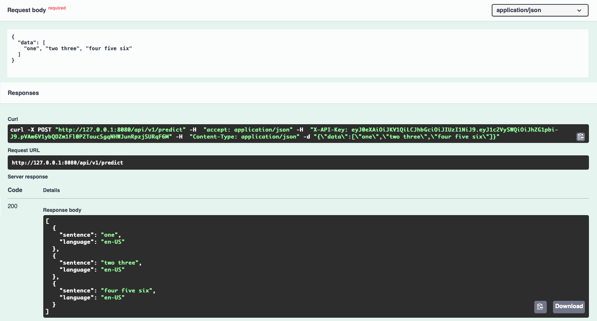

# billenium-keras-api-python


## 1. Prerequisites
- Python 3.8.8
- Aiohttp 3.7
- Tensorflow 2.0



&nbsp;\
&nbsp;

## 2. Setup
```
source ./setup-local-run.sh
```

...develop the code, programming part happens here...

If you want to leave the project and work from the same terminal, optionally you can:
```
deactivate
```

&nbsp;\
&nbsp;

## 3. Test
### 3.1. Test from CLI
```
make tests
```

### 3.2. Test from IDE
Open VS Code, then do:
```
[CMD + SHIFT + P]
>discover unit tests
[Enter]
```

&nbsp;\
&nbsp;

## 4. Run
### 4.1. Run from CLI
```
./start-local-run.sh
```

### 4.2. Run from IDE
Open VS Code, then do:
```
[FN + 5] / [F5]
```

&nbsp;\
&nbsp;

## 5. Deploy
### 5.1. Build docker image locally
```
make docker
```

Deploy to dev with
```
git push origin dev
```

&nbsp;\
&nbsp;

## 6. Notes
Swagger/OpenAPI spec is available after the server has started under URI: http://127.0.0.1:8080/docs